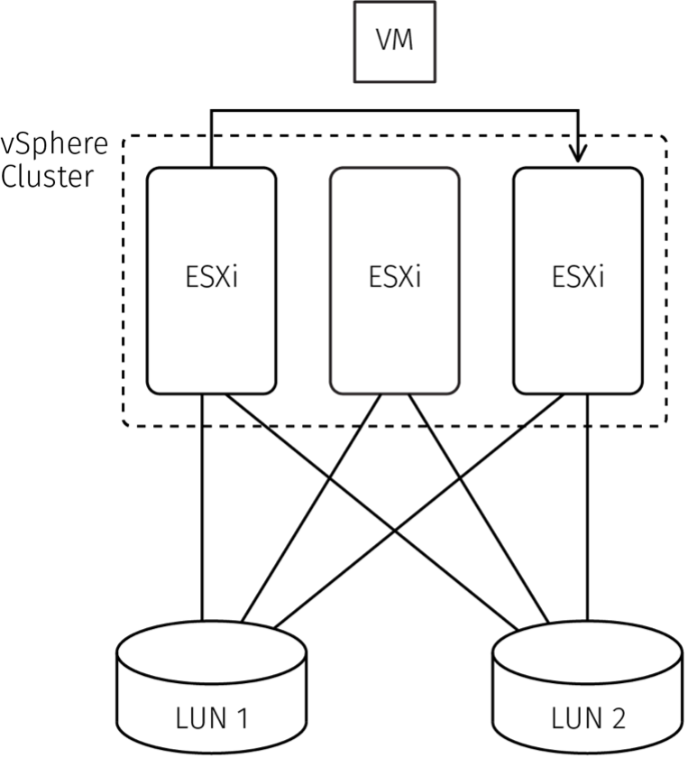
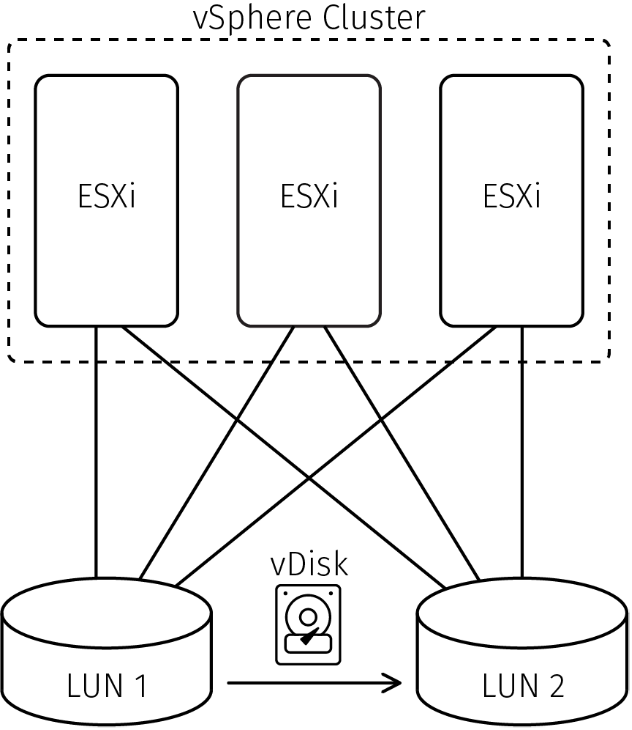

.. _move-a-vm-between-two-hosts-or-two-datastores:

=============================================
Move a VM between two hosts or two datastores
=============================================

There are three methods of migrating a VM from one host or datastore
to another host or datastore within the VMware Server Virtualization 
environment.

* **vMotion:** vMotion migrates a VM from one ESXi host to another
  ESXi host. Depending on the circumstances, the migration can occur
  either offline or online.

* **Storage vMotion:** Storage vMotion migrates a VM from one VMFS
  datastore to another VMFS datastore.

* **vMotion without Shared Storage:** vMotion without Shared Storage
  combines vMotion and storage vMotion. vMotion without Shared Storage is
  most commonly used for migration between two standalone hypervisors.

This section includes the following topics:

* Migrate a VM to a different ESXi host by using vMotion
* Move a VM to a datastore by using storage vMotion
* Migrate by using vMotion without shared storage

.. _migrate-a-vm-to-a-different-esxi-host-by-using-vmotion:

Migrate a VM to a different ESXi host by using vMotion
______________________________________________________

You might need to migrate a VM to a different ESXi host. This migration
process is called vMotion.

Request a vMotion when you want to:

* Migrate a VM to a new ESXi host.
* Migrate a VM from one vSphere cluster to another vSphere cluster.
  
The following diagram illustrates a VM migration process between two
ESXi hosts in a cluster.

**Important:**

* DRS might already be balancing VM placement within the cluster based on
  host workload and DRS rules. If DRS automatically balances VM placement,
  do not request a vMotion.
* If you vMotion a VM to another ESXi host when you have DRS in place,
  you might reverse the vMotion migration or trigger a series of
  subsequent vMotions.
* If you think that the DRS algorithm is not optimal, open a
  Rackspace Technology ticket and request a consultation.

Subject to a variety of conditions, you can complete vMotion either offline
or online. At a minimum, both source and destination hosts must have access 
to the shared datastore(s) where the VM’s vDisks are located. Open a ticket 
and ask us for a consultation so that we can advise you about what is
possible based on your requirements.

The time required to execute a vMotion depends on the amount of vRAM
allocated to VM and the overall resource allocation. An online vMotion
might impact your environment.

To request a vMotion, open a Rackspace Technology ticket and specify
the following information:

* The VMs you want to migrate.
* The source and destination ESXi hosts or vSphere clusters.
* A timeframe for the migration.

.. _move_a_vm_to_a_datastore_by_using_storage_vMotion:

Move a VM to a datastore by using storage vMotion
_________________________________________________

You might need to vMotion a VM’s vDisk(s) to a different datastore.
This migration process is called storage *vMotion*.

Request a storage vMotion when you want to balance the free space on
the datastore.

Subject to a variety of conditions, you can complete vMotion either
offline or online. At a minimum, both source and destination datastores
must be accessible from the ESXi host where the VM is running.
Open a ticket and ask us for a consultation so that we can advise you
about what is possible based on your requirements.

The time required to execute a vMotion depends on the size of the vDisks
connected to the VM and storage performance. An online vMotion might impact
your environment.

The following diagram illustrates a vDisk migration from one LUN or
datastore to another LUN or datastore.

To request a storage vMotion, open a Rackspace Technology ticket and
specify the following information:

* The VMs or the vDisks you want to migrate.
* The source and destination datastores.
* A timeframe for the migration.

