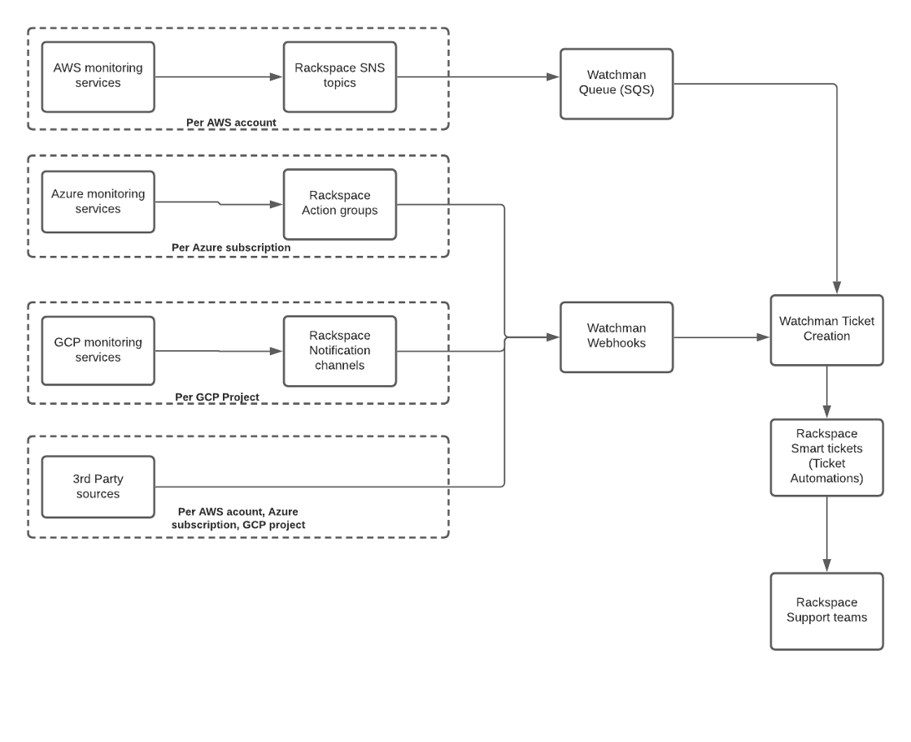

.. _overview:

===========================================
Advanced Monitoring and Resolution overview
===========================================

Rackspace Technology leverages cloud-native monitoring systems to deliver the
Advanced Monitoring and Resolution service. The monitoring system depends
on the cloud platform that you use:

- CloudWatch on Amazon Web Services
- Azure Monitor on Microsoft Azure
- Cloud Monitoring on Google Cloud Platform

The monitoring systems listed above are the primary systems used by AMR
support teams. While the cloud monitoring service might be available to
customer accounts at all service levels, with the AMR service, Rackspace
Technology responds to generated alarms.

AMR uses the Rackspace Watchman service, which combines monitoring systems,
creates support tickets from alarms, and also includes
certified experts who take the necessary actions to mitigate the indicated
alarm conditions 24x7x365. Additionally, you can configure third-party
monitoring services such as New Relic, Datadog, and Prometheus AlertManager
to send events to Rackspace Watchman.

Rackspace Watchman accepts alarms from multiple providers to create a
centralized monitoring hub and notifies both you and Rackspace so that
action can be taken against any alarms.

See the following example workflow:

If you have any further questions, reach out to the Rackspace Support team.
