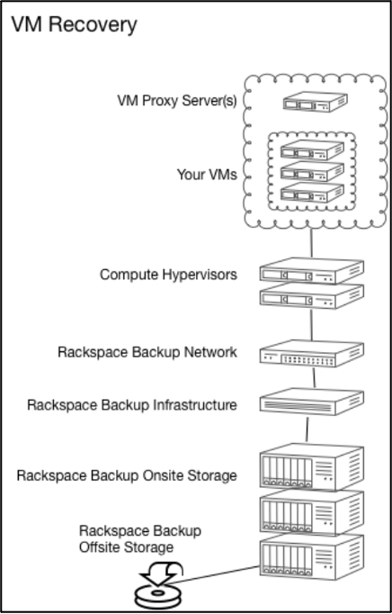

.. _understanding-vm-recovery:

=========================
Understanding VM recovery
=========================

Rackspace Technology provides virtual machine recovery, which is a fully
managed backup and recovery service, specifically for VMware
Server Virtualization environments that are hosted in the
Rackspace Technology data centers. Rackspace Technology Managed Backup and
VMware’s API for Data Protection (VADP) powers VM recovery.
It provides 24-hour RPO and 12-hour RTO.

This section contains the following topics:

* Understanding VM recovery key features
* Understanding VM recovery architecture
* Understanding VM recovery roles and responsibilities
* Understanding VM recovery technical requirements and limitations

.. _understanding-vm-recovery-key-features:

Understanding VM recovery key features
_______________________________________

VM recovery includes the following key features:

* Fully managed backup and recovery 24x7x365.
* VM image-level backup and recovery.
* Individual file-level backup and recovery.
* Database and application specific backup and recovery
  (using guest OS agents).
* 24-hour RPO and 12-hour RTO.
* Rackspace Technology initiation of restoration of
  customer data stored onsite within two hours of the time customer
  requests the restore via a support ticket.
* Rackspace Technology initiation of restoration of customer data stored
  offsite within six hours of the time customer requests the restore via a
  support ticket.

Providing the following benefits when compared to guest
OS based technologies:
* Smaller backup window.
* Protected powered-off VMs.
* Reduced load on ESXi host and VMs.
* Increased recovery scenarios, providing VM image-level backup
  and recovery.
* Faster RTOs.
  
Rackspace Technology Customer Portal allows the customer to view backup
configuration, status, and history. It also enables the customer to request
backup policy changes and submit restore requests.

.. _understanding-vm-recovery-architecture:

Understanding VM recovery architecture
______________________________________

The following diagram illustrates the architecture of VM recovery:

.. _understanding-vm-recovery-roles-and-responsibilities:

Understanding VM recovery roles and responsibilities
____________________________________________________

The following table identifies the roles and responsibilities for the
customer and Rackspace Technology.

+---------------+----------------------------------------+--------------------------------------------------+
| Category      | Customer                               | Rackspace Technology                             |                                                     |
+===============+========================================+==================================================+
| Backup        | Defines the backup and recovery        | Implements the appropriate hypervisor proxies,   |    
| delivery of   | requirements for VMs and applications. | VM configuration and application backup agents.  |
+---------------+----------------------------------------+--------------------------------------------------+
| Monitoring    |                                        | Monitors backup operations.                      |    
+---------------+----------------------------------------+--------------------------------------------------+
| Recovery      | Requests full VM, individual file, or  | Performs the recovery.                           |    
|               | application-level recovery as needed.  |                                                  |
+---------------+----------------------------------------+--------------------------------------------------+

.. _understanding-vm-recovery-technical-requirements-and-limitations:

Understanding VM recovery technical requirements and limitations
________________________________________________________________

VM recovery is subject to the following technical requirements and
limitations:

* Each hypervisor needs a VM recovery proxy.
* VMware datastores containing virtual machines need a minimum of
  15% free space. VM backup jobs are stopped if less than 10% datastore
  space is available.
* Backup and restore times depend on the VM(s) size. VMs larger in size
  and smaller file counts experience a more extended backup and recovery time.
* We use client-based data de-duplication in order to reduce backup times.
  
**Note:** If your VMs do not meet these requirements, then consider VM
Replication Local Edition as an option.

