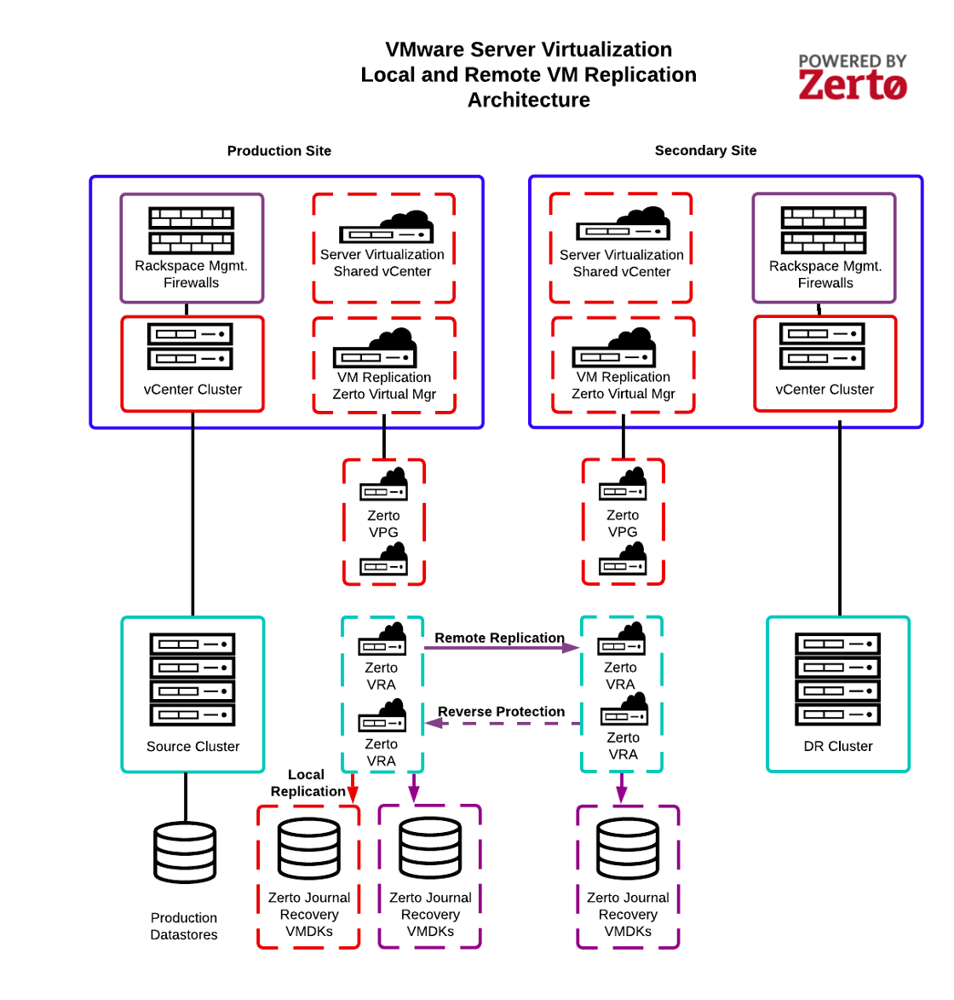

.. _understanding-vm-replication:

============================
Understanding VM replication
============================

VM Replication Enhanced Edition, powered by the Zerto® IT
Resilience Platform™, delivers a fully managed always-on experience.
With Recovery Point Objectives (RPOs) and Recovery Time Objectives (RTOs)
measured in seconds and minutes, VM replication provides near-continuous
storage-agnostic data replication enabling the recovery of VMs from
business-impacting events such as ransomware, hardware failures,
or natural disasters. VM Replication offers both local and
remote replication.

This section includes the following topics:

- :ref:`Understanding VM replication key features <understanding-vm-
  replication-key-features>`
- :ref:`Understanding VM replication architecture <understanding-vm-
  replication-architecture>`
- :ref:`Understanding how VM replication protection works 
  <understanding-how-vm-replication-protection-works>`
- :ref:`Understanding Remote Edition Initial Synchronization
  <understanding-remote-edition-initial-synchronization>`
- :ref:`Understanding Remote Edition Continuous Replication
  <understanding-remote-edition-continuous-replication>`
- :ref:`Understanding VPGs <understanding-vpgs>`
- :ref:`Understanding test operations
  <understanding-test-operations>`
- :ref:`Understanding failover operations
  <understanding-failover-operations>`
- :ref:`Understanding VM replication roles and responsibilities
  <understanding-vm-replication-roles-and-responsibilities>`

.. toctree::
   :maxdepth: 2
   :hidden:

    
   self
   understanding-vm-replication-key-features.rst
   understanding-vm-replication-architecture.rst
   understanding-how-vm-replication-protection-works.rst
   understanding-remote-edition-initial-synchronization.rst
   understanding-remote-edition-continuous-replication.rst
   understanding-vpgs.rst
   understanding-test-operations.rst
   understanding-failover-operations.rst
   understanding-vm-replication-roles-and-responsibilities.rst

  
**Note:** You cannot configure VMs that have one of the following
characteristics for a source VM:

* Active Directory VMs (We support and recommend Active Directory
  native replication.)
* VMs with raw device mappings (RDMs).
* Multi-write disk mode.
* Oracle clusters.
* RHEL clusters.

.. _understanding-vm-replication-key-features:

Understanding VM replication key features
_________________________________________

VM Replication includes the following features:

* **Continuous replication**: Deliver an always-on customer experience.
    * Hypervisor-based block-level replication
* **Outages and disruption**: Protect your brand from all disruptions.
    * Continuous data protection provides RTO and RPO measured in seconds
      and minutes.
    * Complete automation and orchestration of recovery with no manual steps
    * Simplicity with failover and failback in only three clicks.
* **Ransomware attacks**: Avoid ransomware cost, data loss, and downtime.
    * Point-in-time recovery for seamless roll-back to moments before
      the attack.
    * Journal provides rewind capability in near real-time increments
      for up to seven days, by default.
* **Complete data protection**: One platform for all your data
  protection needs.
    * Automated testing to ensure recoverability with no impact to production
    * Reports for full compliance that are consistent with regulations
      like Health Insurance Portability and Accountability Act (HIPAA),
      Payment Card Industry (PCI), and General Data Protection
      Regulation (GDPR)

.. _understanding-vm-replication-architecture:

Understanding VM replication architecture
_________________________________________

The following diagram illustrates the VM Replication architecture,
including the following key components, as defined by the Zerto IT
Resilience Platform documentation:

**Zerto Virtual Manager (ZVM)**: The ZVM manages everything required
for replicating between the source and target sites except for
the actual replication of data. The ZVM is deployed in the
Rackspace Technology management infrastructure and interacts with
the vCenter Server to inventory the VMs, disks, networks,
hosts, and so on. The ZVM also monitors changes in the VMware environment
and responds accordingly. You do not have access to any components of
the Rackspace Technology management infrastructure.

**Zerto Virtual Replication Appliance (VRA)**: The VRA is a VM
that manages the replication of protected VM writes across sites.
Install a VRA on every hypervisor that hosts VMs that require protection
in the source site and on every hypervisor that hosts the replicated VMs
in the target site. You do not have access to the VRA.

**Zerto Virtual Protection Group (VPG)**: The VPG groups VMs for
replication purposes. For example, you should replicate all VMs that
comprise an application, such as the database, application server,
and web server, to maintain data integrity. VPGs allow you to protect,
recover, and test VMs together.

**Zerto Journal**: While processing transactions on the source site,
VRA intercepts every write to a protected VM and sends a copy
of the write, asynchronously, to the target site. The target site adds
the write to a journal managed by the VRA. Each protected VM has its
own journal. By default, the Zerto Journal is located on the Target VM
recovery datastore. Each journal can expand to a size specified in the
VPG definition and automatically shrinks when the expanded capacity
is not needed.

.. _understanding-how-vm-replication-protection-works:

Understanding how VM replication protection works
_________________________________________________

With Zerto's hypervisor-based continuous data replication, Zerto
copies every write to the VM and sends it, asynchronously, to
the target site. At the same time, the source site continues
to process the write.

On the target site, Zerto writes the write to a journal managed by
the Zerto Virtual Replication Appliance (VRA). Each protected
VM has a unique journal. Every few seconds, the system writes
a checkpoint to each journal. These checkpoints ensure write-order
fidelity and crash-consistency to each checkpoint. During recovery,
one of the crash-consistent checkpoints is selected and recovered
to this point.

The Zerto VRA manages the journals for every source VM to be
recovered to the hypervisor hosting that VRA. It also manages
the images of the protected volumes for these target VMs.
During a failover, you can specify that you want to recover
the source VMs in the VPG by using the last checkpoint.
Alternatively, you can specify an earlier checkpoint,
in which case the system synchronizes the recovery of
the mirror images under the VRA to the chosen checkpoint.
Thus, you can recover the environment to the point before
any corruption and ignore later corrupted journal writes.
The cause of the corruption, such as a crash in the source site
or a ransomware attack, does not affect the recovery process.

.. _understanding-remote-edition-initial-synchronization:

Understanding remote edition initial synchronization
____________________________________________________

After you define a VPG, the system updates the Zerto VRA in the target
site with information about the VPG. Then, it synchronizes the data on
the source VMs with the target VMs managed by the VRA on the target site.

For the synchronization to work, ensure that the source VMs are turned on.
To synchronize across the sites, the Zerto VRA requires an active
input-output (IO) stack to have access to the VM data. If the VM is not
running, there is no IO stack to use to access the protected data for
replication to the target site recovery disks.

The synchronization process can take some time, depending on the size of
the source VMs, the amount of data in its volumes, and the bandwidth
between the sites. During this synchronization, you cannot perform any
replication task, such as failover operations.

**Note:** Initial synchronization can cause a spike in bandwidth
usage and might result in bandwidth overage charges.

After synchronization completes, the VRA on the target site includes a
complete copy of every VM in the VPG. At this time, the source VMs in
the VPG are fully protected, and the system sends the delta changes on
these VMs to the recovery site.

.. _understanding-remote-edition-initial-synchronization:

Understanding remote edition continuous replication
___________________________________________________

After the initial synchronization, Zerto copies every write to a source
VM to the target site. At the same time, the source site continues to
process the write and sends the copy asynchronously to the target site,
where the system writes it to a journal managed by a Zerto VRA.
Each protected source VM has a unique journal.

In addition to the writes, every few seconds, the system updates all
journals with a checkpoint timestamp. These checkpoints ensure
write-order fidelity and crash-consistency. You can recover to the last
checkpoint or a user-selected, crash-consistent checkpoint. The choice of
recovery point enables you to recover the source VMs to either the last
crash-consistent point-in-time or a point-in-time before a ransomware
attack.

The system writes data and checkpoints to the target VM's Zerto Journal
until the specified journal history size is reached, which is the
optimum situation. At this point, while new writes and checkpoints
are written to a journal, the older writes are written to the
target VM recovery virtual disks. When you specify a checkpoint to
recover to, the checkpoint must still be in the journal. For example,
if the journal's history is seven days, you can specify recovery to
any checkpoint within the previous seven days. After the time specified,
the system updates the mirror virtual disk volumes (VMDK) maintained
by the Zerto VRA.

**Note:** Initial synchronization can cause a spike in bandwidth usage
and might result in bandwidth overage charges.

The following image illustrates continuous data replication:

.. image:: picture2.png

.. _understanding-vpgs:

Understanding VPGs
__________________

A Virtual Protected Group (VPG) enables you to protect, recover,
and test VMs together while maintaining write-order fidelity.
The Zerto VPG must include at least one VM. After Rackspace Technology
creates the default VPG, you can tell us how to group your source VMs
into VPGs. Consider the following examples:

**Group by customer**: If you host a set of VMs in VMware Server
Virtualization for each of your customers, you can create a VPG for
each customer. This configuration ensures that you maintain write-order
fidelity across all VMs.

**Group by workload or application**: If you host multiple workloads or
applications, you can group your VMs by each workload or application.
For example, for your production application, which comprises a database,
application, and web server, you can group VMs into a single VPG to ensure
write-order fidelity across all three tiers.

**Note:** All the VMs in a VPG must reside in the same VMware vCenter.

**VPG Properties**

For each Source VM, you need to provide Rackspace Technology the
following properties:

* **VPG name**: The VPG name conforms to the following naming
  convention:
  *Account ID – Journal History Days – VMs*

You can replace the VM value in the VPG name with a customer-defined
name. Defining the appendix helps you identify the contents of the VPG.

For example, if you group VMs by customers, use the customer name or ID.
If you group VMs by application or workload, use a descriptor,
such as *ProdCRM*, to represent your Production CRM application.

* **Journal history days**: The target length of time you can roll back VMs
  within a VPG upon recovery.

  By default, each VM has a value of seven days. Setting the Zerto Journal
  History to seven days provides the ability to specify a recovery
  point-in-time within the last seven days.

  For example, if you accidentally decommission the wrong VMs and
  need to recover the VMs, but it takes you five days to identify
  the mistake, you can select the checkpoint before the decommission
  because you have a seven-day journal full of checkpoints.

  **Note:** The actual journal history size depends on the
  available storage. Configuring longer journal history requires
  the storage capacity to keep all changes for the desired period.
  The configured target might not be met, and journal checkpoints
  that have not met the desired journal history target might be
  automatically deleted if there is insufficient space.

* **Boot order:** The order in which the VMs contained within a VPG
  boot upon recovery. VMs boot in ascending order.

  For example, suppose the VPG includes a database, application tier,
  and web server tier, and the database must be available before
  the application tier or web server. In that case, you can set
  the database boot order to 1, application tier to 2, and web server to 3.

* Failover IP range: 
     * **Private:** By default, and subject to availability, when a VM
       fails over to the target site, we set the private IPs to match
       the source IPs. You can customize this to a different IP.
     * **Public:** When a VM fails over to the target site, its
       public IP address is automatically changed. Public Blocks are
       assigned out of the target site location.

.. _understanding-test-operations:

Understanding test operations
_____________________________

You can replace the VM value in the VPG name with a customer-defined name.
Defining the appendix helps you identify the contents of the VPG.

For example, if you group VMs by customers, use the customer name or ID.
If you group VMs by application or workload, use a descriptor, such
as ProdCRM, to represent your Production CRM application.

* **Journal history days:** The target length of time you can roll back VMs
  within a VPG upon recovery.

  By default, each VM has a value of seven days. Setting the Zerto Journal
  History to seven days provides the ability to specify a recovery
  point-in-time within the last seven days.

  For example, if you accidentally decommission the wrong VMs and need to
  recover the VMs, but it takes you five days to identify the mistake,
  you can select the checkpoint before the decommission because you have
  a seven-day journal full of checkpoints.

  **Note:** The actual journal history size depends on the available
  storage. Configuring longer journal history requires the storage
  capacity to keep all changes for the desired period. The configured
  target might not be met and journal checkpoints that have not met
  the desired journal history target might be automatically deleted
  if there is insufficient space.

  * **Boot order:** The order in which the VMs contained within a VPG boot
    upon recovery. VMs boot in ascending order.

    For example, if the VPG includes a database, application tier,
    and web server tier and the database must be available before
    the application tier or web server, you can set the database boot order
    to 1, application tier to 2, and web server to 3.

  * **Use bubble network:** If the VMs are configured to use a
    bubble network, you can’t access them. However, we verify via console
    if the OS has booted up successfully. A bubble network is an isolated
    network which isn’t connected to any other network.

During the test, the source site continues to run normally, and any
changes you make on the target site are discarded at the end of the test.
If you prefer to shut down the source VMs and run the VMs on the secondary
site, consider a planned failover instead.

.. _understanding-failover-operations:

Understanding failover operations
_________________________________

There are two types of failover operations:

* **Planned failover.** Use a planned failover when you want to move
  to your secondary site. Regulatory purpose might require this kind of
  failover, or you might need to prove that your business can operate
  normally when running on a secondary site. To plan this, open a ticket
  with Rackspace Technology.
•	**Unplanned failover.** Use an unplanned failover when an unexpected
  and adverse event occurs, and you need to fail over immediately.
  Call Rackspace Technology for help with executing an unplanned failover.

During a failover, source VMs are shut down (if they are not already down).
To move back to the original site, you must first do a reverse protection.

To improve the RTO during recovery, you can start working even before
the target VM volumes on the target Site have been fully synchronized.
The system analyses every request and response returned from the
Target VM directly or from the journal if the information in the
journal is more current. This process continues until the recovery
site virtual environment is fully synchronized, up to the chosen
checkpoint when the integrity of the protected site was assured.

.. _understanding-vm-replication-roles-and-responsibilities:

Understanding VM replication roles and responsibilities
_______________________________________________________

The following list identifies the roles and responsibilities for
Rackspace Technology VMware Server Virtualization VM replication:

* **Rackspace Technology:** Rackspace Technology is responsible for performing
  the task.
* **Customer:** Customer is responsible for performing the task.
* **Rackspace Technology (Customer Initiated:** Rackspace Technology is
  responsible for performing the task, but we expect the Customer to
  initiate the actions.
* **Not Applicable:** The task or option is not applicable to the selected
  edition.

**Sizing**
+=====================================================+===========================+=========================+
| **TASK**                                            | **LOCAL REPLICATION**     | **REMOTE REPLICATION**  |                        
+-----------------------------------------------------+---------------------------+-------------------------+
| Size customer-required infrastructure for local     | Rackspace                 | Rackspace               | 
| recoveries or failovers to the target site          |                           |                         |
+-----------------------------------------------------+---------------------------+-------------------------+
| Provide VM replication journal-sizing requirements  | Rackspace                 | Rackspace               | 
|                                                     |                           |                         |
+-----------------------------------------------------+---------------------------+-------------------------+
**Deployment**
+=====================================================+===========================+=========================+
| **TASK**                                            | **LOCAL REPLICATION**     | **REMOTE REPLICATION**  |                        
+-----------------------------------------------------+---------------------------+-------------------------+
| Install VM replication management infrastructure    | Rackspace                 | Rackspace               | 
| at source and target site as needed                 |                           |                         |
+-----------------------------------------------------+---------------------------+-------------------------+
| Pair source and target site as peers as needed      | Not Applicable            | Rackspace               | 
|                                                     |                           |                         |
+-----------------------------------------------------+---------------------------+-------------------------+
| Install VM replication virtual replication          | Rackspace                 | Rackspace               | 
| appliance on every customer-dedicated hypervisor    |                           |                         |
| at source and target site as needed                 |                           |                         |
+-----------------------------------------------------+---------------------------+-------------------------+

**Configuration**
+=====================================================+===========================+=========================+
| **TASK**                                            | **LOCAL REPLICATION**     | **REMOTE REPLICATION**  |                        
+-----------------------------------------------------+---------------------------+-------------------------+
| Configure Rackspace network connection between      | Not Applicable            | Rackspace               | 
| source and target site as needed                    |                           |                         |
+-----------------------------------------------------+---------------------------+-------------------------+
| Configure default Virtual Protection Groups (VPG)   | Rackspace                 | Rackspace               | 
|                                                     |                           |                         |
+-----------------------------------------------------+---------------------------+-------------------------+
| Customize networking and VPG configuration          | Rackspace                 | Rackspace               | 
|                                                     | (Customer initiated)      | (Customer initiated)    |
+-----------------------------------------------------+---------------------------+-------------------------+

**Testing and recovery**
+=====================================================+===========================+=========================+
| **TASK**                                            | **LOCAL REPLICATION**     | **REMOTE REPLICATION**  |                        
+-----------------------------------------------------+---------------------------+-------------------------+
| Perform failover test operations                    | Rackspace                 | Rackspace               | 
|                                                     | (Customer initiated)      | (Customer initiated)    |
+-----------------------------------------------------+---------------------------+-------------------------+
| Perform local recovery operations                   | Rackspace                 | Not Applicable          | 
|                                                     | (Customer initiated)      |                         |
+-----------------------------------------------------+---------------------------+-------------------------+
| Perform remove failover and move operations         | Not Applicable            | Rackspace               | 
|                                                     |                           | (Customer initiated)    |
+-----------------------------------------------------+---------------------------+-------------------------+
| Complete database and application recovery after    | Customer                  | Customer                | 
| recovery or failover operations                     |                           |                         |
+-----------------------------------------------------+---------------------------+-------------------------+
| Validate VMs are operating as expected after        | Customer                  | Customer                | 
| recovery or failover operations                     |                           |                         |
+-----------------------------------------------------+---------------------------+-------------------------+
| Perform failback operations from target site to     | Not Applicable            | Rackspace               | 
| source site                                         |                           | (Customer initiated)    |
+-----------------------------------------------------+---------------------------+-------------------------+

**Monitoring and management**
+=====================================================+===========================+=========================+
| **TASK**                                            | **LOCAL REPLICATION**     | **REMOTE REPLICATION**  |                        
+-----------------------------------------------------+---------------------------+-------------------------+
| 24 x 7 monitoring of replication and investigate    | Rackspace                 | Rackspace               | 
| failures between source and target site             |                           |                         |
+-----------------------------------------------------+---------------------------+-------------------------+
| Perform incident resolution for VM replication      | Rackspace                 | Rackspace               | 
| management infrastructure                           |                           |                         |
+-----------------------------------------------------+---------------------------+-------------------------+
| Perform maintenance on VM replication               | Rackspace                 | Rackspace               | 
| management infrastructure                           |                           |                         |
+-----------------------------------------------------+---------------------------+-------------------------+
| Perform maintenance on VM replication               | Rackspace                 | Rackspace               | 
| management infrastructure including replication     |                           |                         |
| software upgrades                                   |                           |                         |
+-----------------------------------------------------+---------------------------+-------------------------+
| Escalation of incidents to technology vendor for    | Rackspace                 | Rackspace               | 
| software support or on-site resolution              |                           |                         |
+-----------------------------------------------------+---------------------------+-------------------------+

