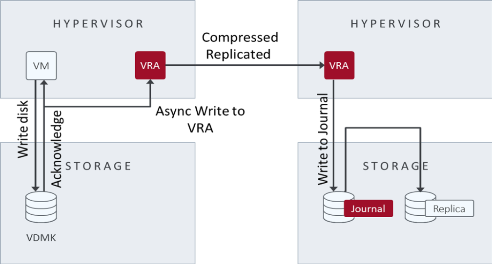

.. _understanding-remote-edition-continuous-replication:

===================================================
Understanding remote edition continuous replication
===================================================

After the initial synchronization, Zerto copies every write to a source
VM to the target site. At the same time, the source site continues to
process the write and sends the copy asynchronously to the target site,
where the system writes it to a journal managed by a Zerto VRA.
Each protected source VM has a unique journal.

In addition to the writes, every few seconds, the system updates all
journals with a checkpoint timestamp. These checkpoints ensure
write-order fidelity and crash-consistency. You can recover to the last
checkpoint or a user-selected, crash-consistent checkpoint. The choice of
recovery point enables you to recover the source VMs to either the last
crash-consistent point-in-time or a point-in-time before a ransomware
attack.

The system writes data and checkpoints to the target VM's Zerto Journal
until the specified journal history size is reached, which is the
optimum situation. At this point, while new writes and checkpoints
are written to a journal, the older writes are written to the
target VM recovery virtual disks. When you specify a checkpoint to
recover to, the checkpoint must still be in the journal. For example,
if the journal's history is seven days, you can specify recovery to
any checkpoint within the previous seven days. After the time specified,
the system updates the mirror virtual disk volumes (VMDK) maintained
by the Zerto VRA.

**Note:** Initial synchronization can cause a spike in bandwidth usage
and might result in bandwidth overage charges.

The following image illustrates continuous data replication:

