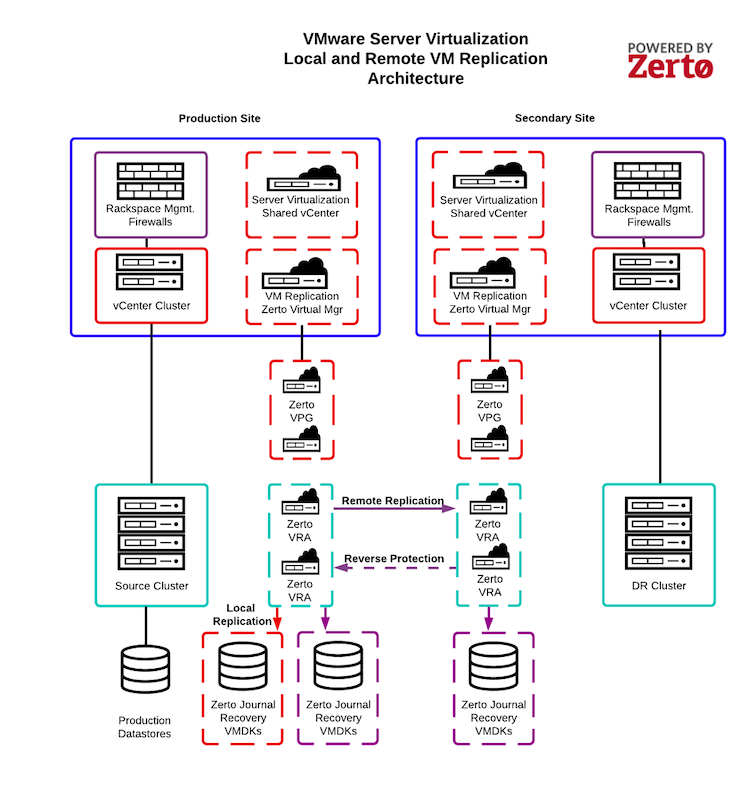

.. _understanding-vm-replication-architecture:

=========================================
Understanding VM replication architecture
=========================================

The following diagram illustrates the VM Replication architecture,
including the following key components, as defined by the Zerto IT
Resilience Platform documentation:

**Zerto Virtual Manager (ZVM)**: The ZVM manages everything required
for replicating between the source and target sites except for
the actual replication of data. The ZVM is deployed in the
Rackspace Technology management infrastructure and interacts with
the vCenter Server to inventory the VMs, disks, networks,
hosts, and so on. The ZVM also monitors changes in the VMware environment
and responds accordingly. You do not have access to any components of
the Rackspace Technology management infrastructure.

**Zerto Virtual Replication Appliance (VRA)**: The VRA is a VM
that manages the replication of protected VM writes across sites.
Install a VRA on every hypervisor that hosts VMs that require protection
in the source site and on every hypervisor that hosts the replicated VMs
in the target site. You do not have access to the VRA.

**Zerto Virtual Protection Group (VPG)**: The VPG groups VMs for
replication purposes. For example, you should replicate all VMs that
comprise an application, such as the database, application server,
and web server, to maintain data integrity. VPGs allow you to protect,
recover, and test VMs together.

**Zerto Journal**: While processing transactions on the source site,
VRA intercepts every write to a protected VM and sends a copy
of the write, asynchronously, to the target site. The target site adds
the write to a journal managed by the VRA. Each protected VM has its
own journal. By default, the Zerto Journal is located on the Target VM
recovery datastore. Each journal can expand to a size specified in the
VPG definition and automatically shrinks when the expanded capacity
is not needed.

